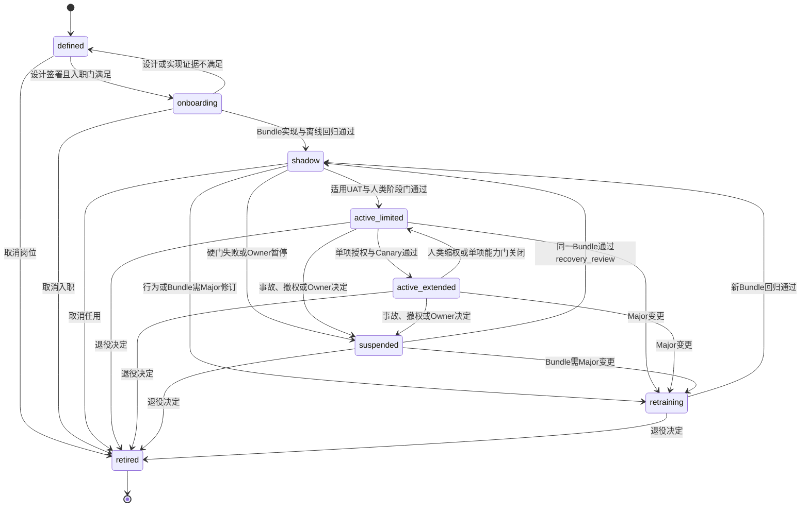

# Digital Role Lifecycle Policy v0.3

> `policy_id: ROLE-LIFECYCLE-01` · 状态：`ROLE-DESIGN-FREEZE-CANDIDATE`  
> 当前事实：DROLE-01～03均为`defined`；本文件可供人类签署评审，但尚未签署、冻结、实现或执行测试。  
> 权威边界：公共生命周期状态遵循`IF-DROLE-MANIFEST-01@0.3`；`recovery_review`是强制决策门，不是第九个公共状态。

## 1. 公共状态与权限

| 状态 | 业务含义 | 允许范围 | 进入下一状态前的最低证据 |
|---|---|---|---|
| `defined` | 岗位设计存在，但未入职 | 不创建真实Profile，不获得运行或Tool权限 | Manifest、SOUL、Skill、Memory、Tool、评价、合同、Owner和阻塞项可追溯 |
| `onboarding` | 已签设计进入实现与离线入职准备 | 仅合成环境、去敏样本和无外部副作用能力 | Profile Bundle实现证据、服务身份、网络策略、离线角色/边界/Schema回归 |
| `shadow` | 候选Bundle跟随获准工作，但不成为正式执行者 | 只产生候选；100%人类复核；R0无真实PII、平台写、外联和预算动作 | 适用UAT、人工修改、硬门、成本、接管、Workspace和连续性证据 |
| `active_limited` | 经授权的R0有限岗位能力投入运行 | 只允许Bundle内A1/A3；BGA平台仍为`MANUAL`；能力可被逐项禁用 | 周期任用评审、权限/对象/版本/审计持续有效 |
| `active_extended` | 某一已验证能力在更大范围或更高自主等级运行 | 仅限独立批准的能力、对象、账号、动作和时窗；不继承到其他能力 | 独立Canary、熔断、补偿、撤权和事故演练证据 |
| `suspended` | 因事故、硬门失败、Owner决定或授权失效停止履职 | 禁止新Run和新Tool动作；只可导出接管/审计材料 | `recovery_review`结论或退役决定 |
| `retraining` | 使命边界不变但行为/Bundle发生Major变化，正在重新训练与回归 | 不得作为active Bundle运行；仅隔离环境和回归集 | 变更影响、更新设计、角色/权限/Schema/异常回归及Owner复核 |
| `retired` | 岗位或该岗位实例结束任用 | Tool/IAM撤权、在途承诺交接、Memory处置和审计封存；不可原状态恢复 | 如需重建，创建新版本/实例并从`defined`开始 |

## 2. 合法迁移与禁止捷径

强制规则：

1. `suspended→active_limited/active_extended`均非法；必须先通过`recovery_review`并进入`shadow`。
2. Major变化必须经过`retraining→shadow`；不得用“紧急”“仅改Prompt”或管理员口吻跳过。
3. 任一新`profile_version_bundle`（包括兼容的Minor/Patch）不得直接替换active Bundle；候选Bundle先在隔离Shadow完成与变更范围相称的回归。旧Bundle是否暂时维持运行由人类Owner按风险决定，不能由Agent自决。
4. `shadow`通过表示候选岗位在规定样本和人工监督下可进入下一评审，不表示组织已达L3、系统已生产可用或业务指标已经改善。
5. 生命周期状态由授权人类通过Workspace/ORS命令改变；Hermes Run、Kanban卡片、模型输出或Agent自评均无权改变状态。

## 3. `recovery_review`强制证据门

`recovery_review`由原暂停决策人主持，至少核对：事故/暂停原因与影响范围、最后可信对象和Commitment状态、人工接管期间的变更、Tool副作用与`unknown`对账、ApprovalGrant和权限现状、对象版本/hash、Memory删除/纠错、Bundle差异、回归范围与结果、残余风险、安全默认和拟恢复能力。

允许结论只有：

- `remain_suspended`：证据不足或风险未关闭；
- `enter_retraining`：需要Major变更；
- `enter_shadow`：同一Bundle根因已关闭且定向回归满足；
- `retire`：不再任用。

评审记录必须含`review_id, role_id, profile_id, bundle_version, incident_or_change_refs, human_takeover_refs, reconciliation_ref, evidence_refs, residual_risks, decision, decision_by_human, decided_at, audit_ref`。评审不能把外部结果`unknown`改写为成功，也不能覆盖人工期间的正式结果。

## 4. Bundle变更分类

| 类型 | 典型变化 | 生命周期要求 |
|---|---|---|
| Major | 使命/组织归属/人类Owner；职责或人类保留权；数据/PII边界；Tool/IAM/网络；A2外部动作；SOUL/Skill/模型策略导致行为边界变化；公共状态、输出Schema或合同破坏性变化 | change-impact → `retraining` → 全部相关离线回归 → `shadow` → 人类阶段门 |
| Minor | 向后兼容字段、低风险Skill方法或事件范围增加，且不扩大数据/行动权限 | 新Bundle → 变更范围回归 → `shadow` → 人类阶段门 |
| Patch | 不改语义和权限的纠错、说明或兼容修复 | 新Bundle → 最小定向回归 → `shadow`；不得原地覆盖active Bundle |

组织归属、业务Owner或三岗位拆分变化须先返回组织架构评审；真实PII、平台A2、预算或客户外联不是普通Bundle升级。

## 5. 阶段门与DEC-01～08

| 门 | 必须满足 | 未满足时安全状态 |
|---|---|---|
| 设计签署/进入`onboarding` | 上游hash一致；公司负责人、业务/风险/数据Owner及DEC-07具名技术Owner按签署包确认 | 保持`defined` |
| 进入`shadow` | DEC-01只有销售写状态、DEC-02 `MONITOR_ONLY`、DEC-03未分类内容额外Grant等安全默认可执行，或对应能力明确禁用；DEC-05 SourceRef/权威载体边界可执行；DEC-06继续真实PII `DISABLED`或已另行合法批准；Profile、服务身份、网络和Workspace隔离可验证 | 保持`onboarding`或回`defined` |
| 进入`active_limited` | 适用能力的DEC-01～03已签或该能力明确禁用；DEC-05/06边界、DEC-07责任和DEC-08人类批准的门槛可执行；UAT、接管、恢复、Workspace与全人工连续性有证据 | 保持`shadow` |
| 进入BGA `active_extended` A2 | DEC-04关闭；按平台+账号+动作独立ApprovalGrant、官方Connector/IAM、Canary、幂等、回执、熔断、补偿和事故演练 | 保持`MANUAL`；DEC-04不阻塞A1/A3的`active_limited` |

DEC安全默认始终有效：DEC-01只有销售身份写`pending/valid/invalid/needs_more_info`及版本化原因码；DEC-02未签时为`MONITOR_ONLY`且不自动外发提醒；DEC-03未分类外部内容要求公司负责人额外ApprovalGrant；DEC-04上游已批四平台R0均`MANUAL`，视频号仍为范围外`DORMANT_SCOPE_CANDIDATE`；DEC-05默认`authority=unknown/manual_reference`；DEC-06真实PII `DISABLED`；DEC-07无具名技术Owner不得冻结或入职；DEC-08为`BASELINE_ONLY`，不得虚构阈值、SLA、容量或成本上限。

## 6. 暂停、退役与审计

- 暂停立即撤销新Run/Tool资格，保留不可变审计，生成TakeoverPacket；等待或在途事项由具名人类接管，不由另一Agent自动继承权限。
- 退役前完成在途Commitment/Handoff、服务身份和Tool撤权、Memory删除/导出验证、Session失效、Workspace目录更新、审计封存和人工连续性确认。
- 所有迁移证据必须绑定`role_id + profile_id + profile_version_bundle + authority_snapshot + human decision`；技术成功、Schema通过和业务验收分开记录。
- 指标阈值、评审周期和恢复时限在DEC-08关闭前只采baseline；本政策不声称任何迁移、测试或签署已经完成。
