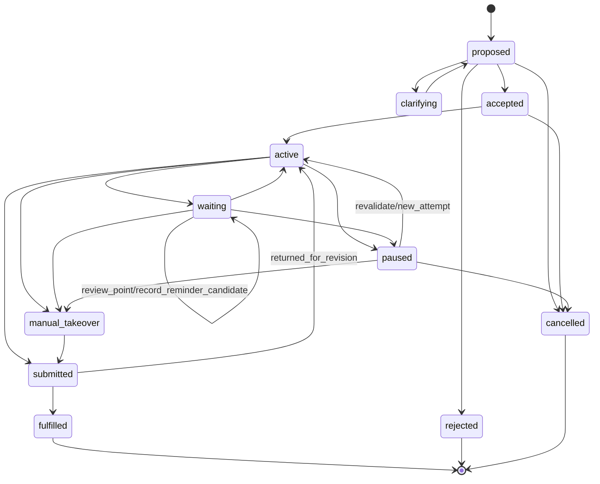

# WorkCommitment 合同 v0.3

> `contract_id: IF-WORK-COMMITMENT-01` · 状态：`INTERFACE-FREEZE-CANDIDATE`  
> 定义：请求者与承诺岗位对目标、边界、产物和验收的显式协定；不是强制派单或中央Workflow步骤。

## 1. 字段

| 字段组 | 必填内容 |
|---|---|
| 身份 | `commitment_id, version, correlation_id, parent/related_ids` |
| 意图 | `purpose, expected_outcome, business_reason_refs, requester_role, business_owner_role` |
| 承诺 | `proposed_role, committed_role, commitment_response, response_reason`；接收者明确接受后才有committed_role |
| 输入 | `input_refs[]`含object ID/version/hash/SourceRef/sensitivity；禁止PII |
| 输出 | `output_contract_ref, acceptance_checks[], intended_recipient` |
| 授权 | `authority_snapshot_id, allowed_data/tool/action scope, expiry/review point` |
| 依赖 | `dependencies[], approvals_required[], blocking_conditions[]` |
| 时间 | `created_at, review_at, due_at(optional and human-set)`；DEC-08前不编造SLA |
| 状态 | `status, status_revision, status_reason_code, waiting_reason, blocked_reason, paused_reason, takeover_ref`；公共状态只使用本合同枚举 |
| 结果 | `output_refs[], handoff_refs[], acceptance_result, residual_risks[]` |
| 执行引用 | `attempt_refs[]`；重试、恢复、退回补充均创建新TaskAttempt |
| 历史与取消 | `state_history, cancellation(cancelled_by/at/reason)` |
| 审计 | event/tool/policy/human decision/audit refs |

## 2. 状态与合法转换

公共状态固定为`proposed/clarifying/accepted/active/waiting/submitted/fulfilled/rejected/manual_takeover/paused/cancelled`。等待人类、依赖、批准、反馈或阻塞均写为`waiting + waiting_reason`；依赖声明是协商内容；退回补充和验收接受是迁移事件；需要接管是风险标记。禁止把这些另建为第二套公共状态。

`fulfilled/rejected/cancelled`为业务终态。`paused→active`、`waiting→active`和`submitted→active`都必须重新验证对象、Manifest、Bundle、权限和Context并创建新TaskAttempt；不得重放旧Session或篡改历史。MO可提出和跟踪，不能代替committed role接受、代替recipient验收或代替Owner取消。

## 3. 规则与验收

- 输入版本漂移使旧权限快照和提交失效，必须重协商/重新快照。
- output必须经RoleHandoff提交；Tool成功、消息送达和Run结束不触发`fulfilled`。
- 未完成依赖、approval pending、residual risk和unknown外部结果必须显式。
- ORS-03是本状态的唯一事实源；Hermes Kanban和Workspace卡片只能投影，不能直接改状态。
- 测试接受/澄清/依赖/拒绝、取消、并发修订、循环依赖、越权、到期、岗位暂停、Handoff退回、接管和恢复对账。
