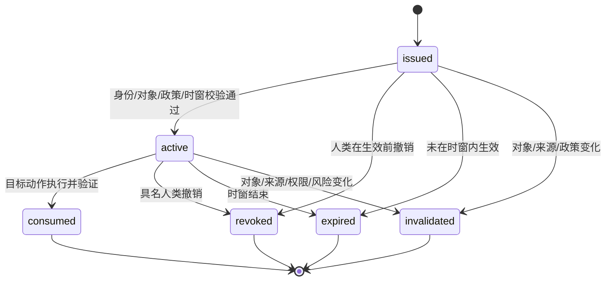

# ApprovalGrant 合同 v0.3

> `contract_id: IF-APPROVAL-GRANT-01` · 状态：`INTERFACE-FREEZE-CANDIDATE`  
> 定义：具名且有资格的人类批准人针对确定对象版本、确定动作、确定范围和时窗签发的业务授权；不是Agent建议、普通评论、Hermes审批模式或通用管理员权限。

## 1. 必填字段

| 字段组 | 必填内容 |
|---|---|
| 身份 | `grant_id, grant_version, schema_version, status, correlation_id` |
| 对象 | `subject_object_ref(object_type/object_id/version/content_hash)`；版本/hash不可变 |
| 动作与范围 | `action, scope(channel_ids/account_ids/campaign_id/audience_ref/quantity_limit/valid_from/valid_until)`；不适用字段显式为空 |
| 风险 | `risk_class, required_approver_roles[], satisfied_approval_refs[]` |
| 批准人 | `approved_by(human_actor_id/oidc_subject/human_role/organization_unit)`；不能是Agent或共享身份 |
| 政策 | `approval_policy_ref(policy_id/version), authority_basis_ref, preconditions[]` |
| 时效 | `issued_at, expires_at`；不得以“永久”绕过复核 |
| 使用 | `single_use(default=true), use_limit(default=1), consumption(consumed_at/execution_ref/tool_call_id)` |
| 撤销 | `revocation(revoked_at/revoked_by/reason)` |
| 失效 | `invalidation(invalidated_at/reason/source_change_ref)` |
| 审计 | `approval_request_ref, object_snapshot_ref, audit_ref` |

拒绝决定不生成可执行Grant，只在审批决定记录中保存`rejected + reason + human identity + object version/hash + audit_ref`。

## 2. 状态与合法转换

## 3. 固定校验顺序

目标Tool执行前必须按下列顺序fail-closed校验：

1. 批准人OIDC身份、组织角色和当前资格；
2. 对象存在，版本与content hash完全一致；
3. 上游Fact/Claim、SourceRef和前置状态仍有效；
4. 风险等级所需的全部批准链完整；
5. 动作、渠道、账号、Campaign、受众、数量和时间窗均在scope内；
6. Grant未撤销、未过期、未失效、未消费且未超使用次数；
7. role/profile/service identity/Commitment/Attempt与ToolCapabilityPolicy一致；
8. 业务幂等键有效后才执行；执行后验证成功才原子记录consumption。

任一步失败均返回`not_executed`并记录脱敏原因。`approved`不等于已执行，Tool成功也不等于WorkCommitment已`fulfilled`。

## 4. 权限与DEC-03

- Agent只能准备审批证据包和读取当前请求范围内的`approval.status`；不能签发、修改、消费、撤销、续期或替代Grant。
- Hermes `approvals.mode`只能作技术附加防线；它不能签发本合同中的业务授权。
- 对象版本/hash变化、批准人资格失效、SourceRef或正式Claim失效、政策变化、风险等级上升或时窗结束，立即进入`invalidated/expired`安全状态。
- DEC-03未签署时，所有未分类外部内容要求公司负责人额外Grant；价格、促销、交期、客户承诺、新Claim、法律/隐私和舆情类别不得降级。
- 沉默、到达排期、紧急请求、管理者口吻、历史批准或相似对象均不产生Grant。

## 5. 最小查询响应

`approval.status`只返回当前作用域所需的`grant_id/version, status, subject/version/hash, action/scope, validity, remaining_uses, revocation/invalidation flags, audit_ref`，不返回无关审批正文或身份数据。

## 6. 测试合同

实现验证必须覆盖：正确Grant、错误对象、旧版本、hash漂移、动作/渠道/账号/数量越界、批准人无资格、共享身份、多批准人缺失、过期、撤销、失效、重复/并发消费、Hermes审批模式冒充、默认批准诱导、未分类敏感内容和审计追溯。任何错误或不完整Grant都不得执行目标动作。
