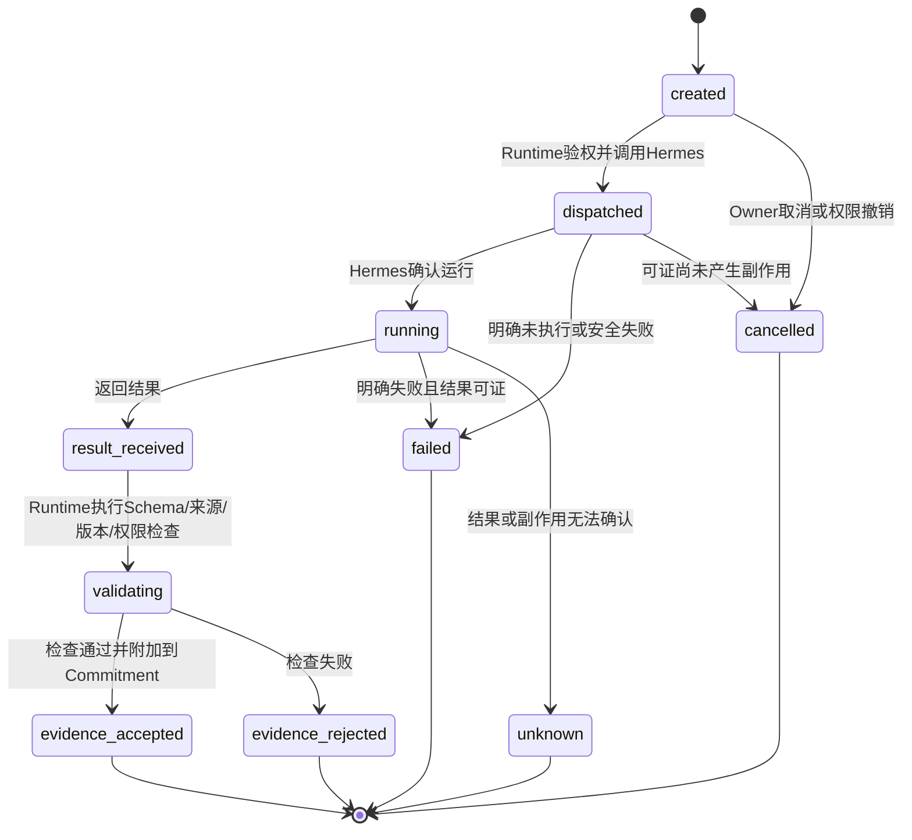

# AgentRun与TaskAttempt 合同 v0.3

> `contract_id: IF-AGENT-RUN-01` · 状态：`INTERFACE-FREEZE-CANDIDATE`  
> 用途：把已接受的WorkCommitment映射为一次可预算、可验证、可恢复的Hermes运行尝试；不改变岗位使命或业务完成条件。

## 1. 对象关系

- 一个WorkCommitment可以有多个TaskAttempt；每次重试、恢复或重新授权都创建新`attempt_id`。
- 一个TaskAttempt最多关联一个主AgentRun；同岗位Delegate是其子运行证据，不形成跨重启承诺或外部副作用。
- Run完成只产生`submitted execution evidence`；WorkCommitment是否`fulfilled`仍由输出合同、RoleHandoff和请求者/Owner验收决定。

## 2. TaskAttempt必填字段

`attempt_id, commitment_id/version, attempt_no, parent_attempt_id(optional), trigger_reason(initial/retry/resume/returned/recovery), role_id, profile_id, context_snapshot_id/hash, authority_snapshot_id, business_idempotency_key, status, agent_run_id(optional until dispatched), created_at, started_at, ended_at, output_refs[], failure_class, retryable, retryability, handoff_ref, audit_ref`。

R0采用`TaskAttempt 1:1 主AgentRun`。任何重试、暂停恢复、Handoff退回补充、Runtime恢复或重新授权都创建新Attempt；旧Attempt只能追加终态证据，不能被覆盖。相同业务动作沿用`business_idempotency_key`，技术调用另有唯一`tool_call_id`。

## 3. Run请求必填字段

`agent_run_id, hermes_run_id(optional until accepted), attempt_id, commitment_id/version, correlation_id, causation_id, role_id, profile_id, profile_service_identity_id, role_manifest_version, profile_bundle_version, soul_version, skill_allowlist(id/version), model_id, model_policy_id/version, hermes_version, runtime_version, policy_bundle_version, object_refs(id/type/version/hash), context_snapshot_id/hash, tool_policy_id/version, allowed_tool_capabilities, output_schema_id/version/hash, budget(tokens/cost/time/tool_calls), deadline, business_idempotency_key, parent_attempt_id(optional), created_by_runtime, created_at`。

Runtime在调用Hermes async `/v1/runs`前必须验证：岗位生命周期、profile身份、Commitment处于`accepted/active`，或处于`waiting`且依赖已满足并完成恢复校验；Context未失效；对象版本、权限快照、预算和输出Schema均匹配。任何不满足均不启动Run。

## 4. TaskAttempt状态

这些是组织侧技术投影，不声称等同Hermes内部原生状态；实现前由具名技术Owner核验目标版本并记录映射。

## 5. 结果与恢复

结果必须包含：`run_status, started_at, completed_at, raw_run_ref, output_ref/hash, output_schema_validation, source_validation, object_version_validation, authority_validation, policy_validation, tool_call_refs, usage/cost, failure_class, retryable, retryability, redacted_message, submitted_output_refs, audit_ref`。

- `evidence_accepted`只允许Commitment进入或保持`submitted`，不能直接`fulfilled`。
- 明确无副作用失败可按Policy新建attempt并沿用同一业务幂等键；不得原地重写旧attempt。
- `unknown`一律`retryability=unsafe`并创建人工对账；不能更换幂等键绕过。
- 暂停、恢复、对象变化、权限变化或Major版本升级均生成新ContextSnapshot和新attempt；禁止从旧Session继续外部动作。

## 6. 测试

覆盖正常Run、错误profile、服务身份冒用、Manifest/Bundle不兼容、Commitment未接受、Context过期、对象漂移、Skill/Tool越界、预算/期限、Schema失败、Tool unknown、Runtime中断、恢复新attempt、重复回调、Delegate失败和Run成功但业务验收退回。
