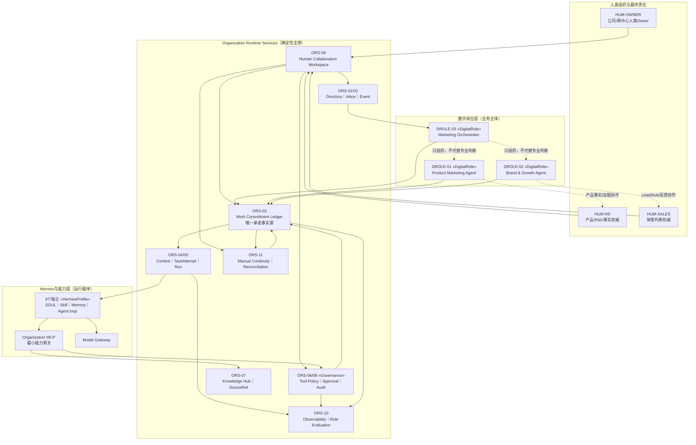
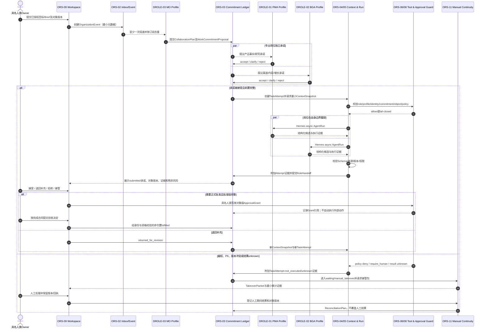
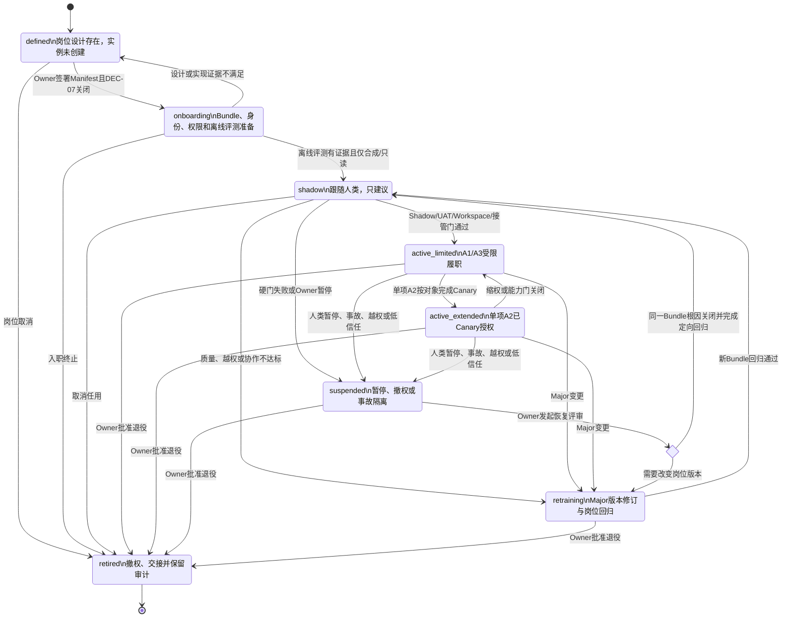
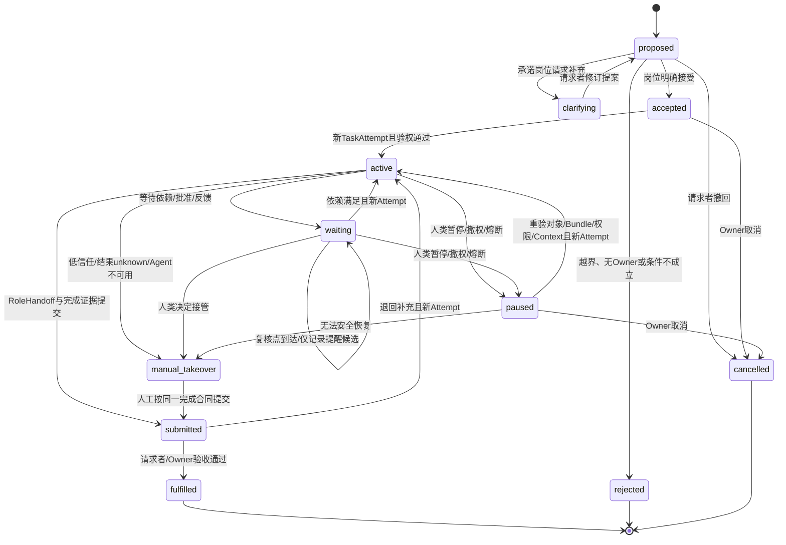

# S2 AI原生营销 Agent岗位UML配套图包 v0.3

> 状态：`UML-FREEZE-CANDIDATE`  
> Subject：三个数字岗位及其与Human Collaboration Workspace、Organization Runtime Services和Hermes的协作  
> 建模基线：Agent岗位设计V0.3；上游技术方案与UML图包V1.1-R1  
> 规范：OMG UML 2.5.1语义；Mermaid `flowchart`用于UML-style组件近似，其余使用时序图和状态机图  
> 权威说明：图是合同的视图，不替代Role Manifest、公共合同、权限、Schema或验收标准；若本图与上游主技术方案冲突，以上游主技术方案为准并触发V0.3 change-impact。

## 1. 建模边界

### 1.1 目标

本图包只回答四个固化问题：

1. 三个数字岗位、Hermes profile、Runtime和人类Workspace怎样分工；
2. 一个组织事件怎样形成承诺、运行、交接、人工批准或接管；
3. 数字岗位怎样入职、扩权、暂停、复训和退役；
4. WorkCommitment怎样协商、履行、等待、验收和恢复。

### 1.2 范围与非目标

- 范围：DROLE-01～03、10项公共合同、ORS-01～11相关职责、Hermes v0.20.0 profile映射、R0人工外部动作。
- 非目标：物理API、数据库Schema、部署地址、模型选型、Connector实现、真实Profile、生产HA和平台A2。
- 已知事实：两个中心、三个岗位、MO跨中心服务、R0 MANUAL、真实PII DISABLED、ORS-03是承诺事实源。
- 设计假设：Runtime能实现合同要求；DEC-07关闭前没有具名技术Owner。
- 开放问题：DEC-01～08及全部人类签署尚未关闭；图状态不能被解释为实现完成。

## 2. 图目录

| 图ID | UML图型 | 回答的问题 | 追溯 | 状态 |
|---|---|---|---|---|
| UML-A01 | UML-style组件图 | 数字岗位与支撑层边界是什么 | DROLE-01..03、ARCH-01..12、IF-* | 冻结候选 |
| UML-A02 | UML时序图 | Event到Commitment、Run、Handoff、Approval/接管怎样发生 | EVT-01..11、IF-EVENT/COMMIT/RUN/HANDOFF/APPROVAL | 冻结候选 |
| UML-A03 | UML状态机图 | DigitalRole怎样入职、扩权、暂停、复训和退役 | ROLE-06..08、UML-R03 | 冻结候选 |
| UML-A04 | UML状态机图 | WorkCommitment有哪些唯一合法公共状态 | IF-WORK-COMMITMENT-01、UML-R04 | 冻结候选 |

未重复绘制上游部署图UML-R05；V0.3未增加新的部署事实。

## 3. 统一模型元素

| 元素ID | 名称 | 类型 | 语义/责任 | 出现图 |
|---|---|---|---|---|
| HUM-OWNER | 具名人类Owner/批准人 | Actor | 目标、专业判断、批准、评价、暂停、接管和最终责任 | A01/A02 |
| HUM-RD | 产品/R&D接口 | Actor | 产品事实和证据权威 | A01 |
| HUM-SALES | 销售接口 | Actor | 有效询盘唯一判断与反馈写入 | A01 |
| DROLE-01 | PMA | Digital Role | 产品事实整理、研究、Claim候选和产品资产 | A01/A02/A03 |
| DROLE-02 | BGA | Digital Role | 品牌内容、人工发布准备、LeadStub和归因候选 | A01/A02/A03 |
| DROLE-03 | MO | Digital Role | 协作计划、承诺、依赖、提醒、升级、接管和复盘 | A01/A02/A03 |
| ORS-01 | Organization & Role Directory | Runtime组件 | 岗位、Owner、任命、Bundle和生命周期目录 | A01 |
| ORS-02 | Role Inbox & Event Bus | Runtime组件 | 至少一次事件投递、去重和死信 | A01/A02 |
| ORS-03 | Work Commitment Ledger | Runtime组件/事实源 | 承诺、状态、依赖、Handoff和验收引用 | A01/A02/A04 |
| ORS-04/05 | Context & Run Coordinator | Runtime组件 | 最小Context、TaskAttempt、Hermes Run和结果验证 | A01/A02 |
| ORS-06/08 | Tool & Governance Guard | Runtime组件 | role/profile/identity/commitment验权、ApprovalGrant和审计 | A01/A02 |
| ORS-07 | Organization Knowledge Hub | Runtime组件 | SourceRef、候选/正式知识、版本和受控检索；人类保留确认权 | A01 |
| ORS-09 | Human Collaboration Workspace | 边界组件 | 人类协作入口；不保存第二套事实 | A01/A02 |
| ORS-10 | Observability & Role Evaluation | Runtime组件 | 分层采集运行、质量、成本、接管与风险证据；人类评价岗位 | A01 |
| ORS-11 | Manual Continuity & Reconciliation | Runtime组件 | 全人工接管、证据登记和恢复对账；不替业务Owner裁决 | A01/A02 |
| HERMES | Hermes Profiles | 执行组件 | 三个独立profile运行Agent loop；不是安全边界 | A01/A02 |
| ORG-OBJ-03 | WorkCommitment | 组织对象 | 岗位接受的目标、输入、输出、依赖和完成条件 | A02/A04 |
| ORG-OBJ-04 | RoleHandoff | 组织对象 | 带版本、证据、检查、未完成项和下一责任人的交接 | A02 |
| GOV-GRANT | ApprovalGrant | 治理对象 | 具名人类对确定对象、动作、范围和时窗的授权 | A02 |

图中的`«DigitalRole»`、`«HermesProfile»`、`«OrganizationRuntime»`、`«Skill/Memory»`和`«Governance»`是项目轻量扩展标签，不是假称为UML标准stereotype。

## 4. UML-A01：三岗位与Runtime组件边界

- UML图型：UML-style组件图（Mermaid flowchart近似）；
- 设计问题：谁承担业务使命，谁只提供运行支撑；
- 抽象层级：Agent系统逻辑组件；
- 追溯：上游UML-R01/R05、ORG-S01..10、ARCH-01..12、DROLE-01..03。

### 图示结论

1. 三个DROLE是承担持续使命的组织主体；Hermes profile是运行单元，Runtime是支撑层。
2. MO组织跨岗位协作，但不能接受其他岗位的承诺、验收其专业产物或签发批准。
3. Profile只能访问Organization MCP和Model Gateway；profile、Skill文本和Workspace UI都不是权限边界。
4. ORS-03是WorkCommitment唯一事实源；Kanban和Workspace卡片未画为事实源。ORS-07/10/11分别提供知识、观测评价和人工连续性支撑，不取得人类确认、评价或例外决定权。

## 5. UML-A02：Event到承诺、运行、交接与人工决定

- UML图型：UML时序图；
- 设计问题：Run成功为什么不等于业务完成，人工批准和接管在哪里发生；
- 抽象层级：一个跨中心协作场景；
- 追溯：上游UML-R02、EVT-01..11、IF-EVENT-SUB-01、IF-WORK-COMMITMENT-01、IF-AGENT-RUN-01、IF-ROLE-HANDOFF-01、IF-APPROVAL-GRANT-01。

### 图示结论

1. 接受事件不等于接受承诺；接收岗位可以澄清或拒绝。
2. 每次Run前都重新绑定岗位、profile、服务身份、Commitment、对象、权限和Context。
3. AgentRun成功只产生可验证证据；RoleHandoff提交后仍由请求者/人类Owner按完成合同验收。
4. ApprovalGrant由具名人类签发，R0只支持人工外部执行；外部结果unknown不自动重试。

## 6. UML-A03：DigitalRole生命周期

- UML图型：UML状态机图；
- Subject：DigitalRoleManifest + Role Appointment；
- 追溯：上游UML-R03、ROLE-06..08、DEC-07/08。

### 图示结论

- `RecoveryReview`是选择门，不是公开生命周期状态；任何恢复都先进入`shadow`，不从暂停直接回active。
- SOUL、Skill、模型或岗位行为的Major变化必须进入`retraining→shadow`，不得以恢复为名直接回到active。
- `bundle_design_status`、`role_lifecycle_state`和`runtime_instance_state`分别管理，当前为`freeze_candidate / defined / not_created`。

## 7. UML-A04：WorkCommitment公共状态机

- UML图型：UML状态机图；
- Subject：ORG-OBJ-03 WorkCommitment；
- 追溯：上游UML-R04、IF-WORK-COMMITMENT-01、UAT-01/06/11/14。

### 图示结论

- 公共状态只有图中11项；等待原因、退回事件、接管请求和验收结果不另建第二套状态。
- ORS-03是唯一写入者；Kanban和Workspace只投影。
- Run、Tool、消息投递或Agent自述均不能直接把承诺置为`fulfilled`。

## 8. 跨图一致性检查

| 检查 | 结果 | 依据/说明 | 未决Owner |
|---|---|---|---|
| Actor与边界一致 | 设计一致 | A01/A02均由具名人类保留批准、销售和事实权；三Agent在系统内部 | 无设计冲突 |
| 活动与消息一致 | 设计一致 | A02覆盖事件、承诺、Run、Handoff、批准、退回和接管 | 实现证据待技术Owner |
| 消息与状态迁移一致 | 设计一致 | A02的accept/wait/submit/return/takeover/fulfil均存在于A04 | 实现证据待技术Owner |
| Lifeline与组件一致 | 设计一致 | A02所有参与者均能在A01或Actor表找到 | 无设计冲突 |
| 岗位生命周期一致 | 设计一致 | A03继承上游UML-R03；RecoveryReview仅为choice | 人类签署待完成 |
| 权威数据语义一致 | 设计一致 | ORS-03唯一承诺事实源；Workspace/Kanban非事实源 | 无设计冲突 |
| R0权限一致 | 设计一致 | A02无平台写、PII、预算、外联或Agent批准 | DEC-01～08待签 |
| 需求到验证链 | 已定义、未执行 | 追踪到UAT与岗位回归；不声称测试通过 | 业务/技术/质量Owner |

## 9. 上游追踪

| 上游视图/决定 | V0.3模型元素 | 本图 | 验证引用 |
|---|---|---|---|
| UML-R01 五层架构 | DROLE、ORS、Hermes、Workspace | A01 | ARCH-01..12、Profile Bundle审查 |
| UML-R02 跨中心承诺 | Event、MO、PMA、BGA、Commitment、Handoff | A02 | UAT-01、UAT-R06..08 |
| UML-R03 岗位生命周期 | DigitalRole状态和RecoveryReview门 | A03 | 生命周期门、岗位回归 |
| UML-R04 承诺生命周期 | WorkCommitment 11项公共状态 | A04 | UAT-06/11/14、状态合同测试 |
| UML-R05 部署与信任 | 独立profile、MCP、Model Gateway、Workspace | A01 | ARCH-03/04/09、隔离测试 |
| DEC-01～04 | 销售唯一判断、MONITOR_ONLY、额外批准、MANUAL | A01/A02 | BGA/MO岗位UAT |
| DEC-05～08 | SourceRef、PII关闭、具名技术Owner、baseline | A01/A03 | 数据/隐私/任用门 |

## 10. 不适用图型

| 未采用图型 | 理由 | 何时补充 |
|---|---|---|
| 用例图 | 上游角色与可观察能力已由组织方案和UML-R01/R02覆盖，本版主要消除运行合同歧义 | 岗位服务对象或系统边界改变时 |
| 活动图 | A02时序图已覆盖关键职责和异常，另画会与承诺状态机重复 | 需要详细描述人工发布或接管泳道时 |
| 概念类图 | 公共合同已定义逻辑对象，物理多重性和Schema实现尚属开发详细设计 | 开发进行领域模型评审时 |
| 部署图 | V0.3未改变上游UML-R05部署与信任事实 | 节点、网络区或运行拓扑改变时 |

> 本图包完成的是“模型与设计合同一致”的候选检查，不证明架构已实现、代码正确、权限有效、性能达标或生产可用。
