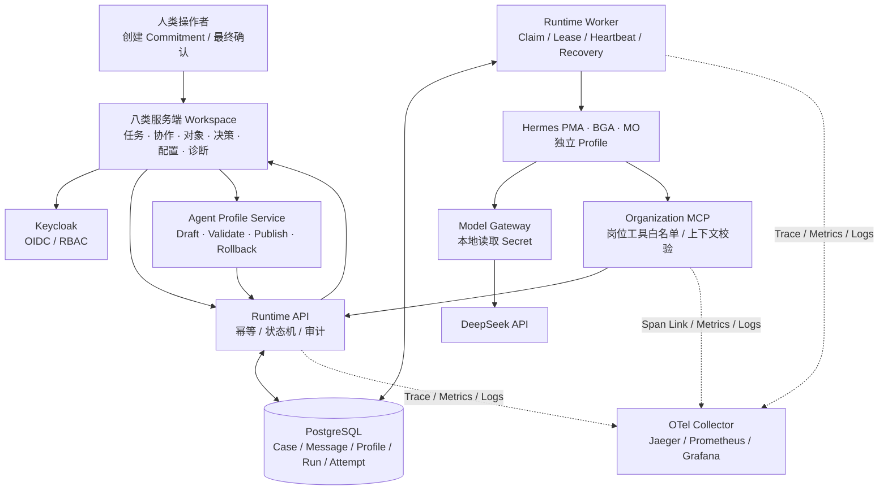
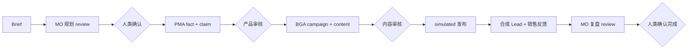
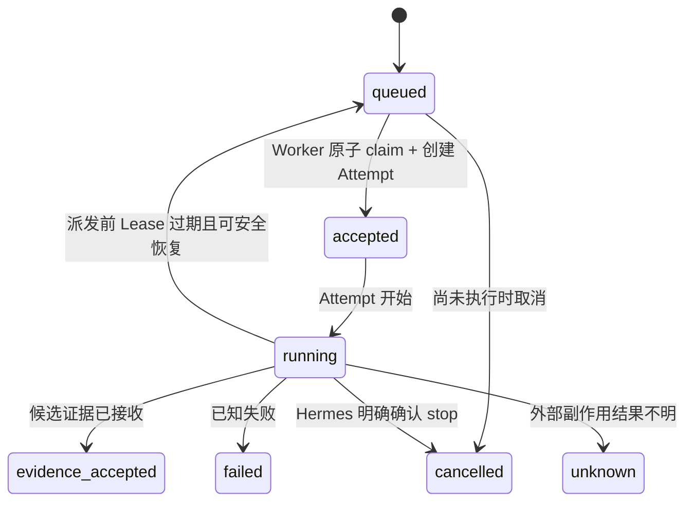

# 1Cat Agent Runtime 架构一页图

## 一句话定位

1Cat Hermes OS R0 是一套本机 Compose 部署、有人类最终决策边界的 Agent Runtime：
它管理 PMA、BGA、MO 三个长期数字岗位的身份、任务状态、不可覆盖 Attempt、受限工具调用、
故障恢复与全链路观测，而不只是向大模型发送一次请求。

## 主运行链

正式前端只展示服务端事实并提交人类动作，旧Reducer界面仅在 `?mode=prototype` 隔离；Runtime API 是统一写入边界；Worker 不拥有业务最终
决定权；Hermes 只能通过岗位白名单 MCP 读写候选对象；DeepSeek Key 不进入浏览器、Profile、
镜像或日志。每个工作流或聊天 Run 固化已发布 Profile 的 version、hash 和完整快照，后续草稿
或发布不会改写历史执行上下文。

## 三 Agent 业务状态机

Case 通过 `case_id` 关联多条独立 Run/Trace；跨人类等待使用 Span Link 和业务关联字段，
不伪造一条长期连续 Trace。服务端返回唯一 `next_actions`，前端不能自行跳过门禁。

## Run 状态与执行不变量

四个关键不变量：

1. claim、Attempt 创建和 Lease 设置位于同一数据库事务。
2. 写回必须匹配 `current_attempt_id + lease_token`，过期 Worker 不能覆盖新执行结果。
3. 外部派发前可安全恢复；派发后结果不明必须进入 `unknown/unsafe`，不能盲目重试。
4. `evidence_accepted` 和 Commitment `submitted` 只代表候选已提交，只有具名人类能确认
   `fulfilled`。

## 已实现的工程证据

| 能力 | 本机实测证据 |
|---|---|
| 真实 Agent | PMA、BGA、MO 三岗位 DeepSeek Run 3/3 完成，共写入 7 个授权候选对象 |
| 完整业务 Case | 合成模式 9 阶段/4 Run 确定性通过；真实模式完成并保留 1 次安全重试历史 |
| 人类协作对象 | 真实 Case 持久化 4 Commitment、2 Handoff、6 Approval、1 simulated 回执 |
| 八类服务端工作区 | 任务、协作、对象、决策、异常、Daily、配置、诊断统一读取服务端事实；前端回归 10/10 |
| Agent 协作 | MO/PMA/BGA 消息、Change Request、Handoff、chat Run、回复与对象谱系均持久化 |
| 配置复现 | Profile 六件套/Skill/权限/Prompt 可版本发布；Run 固化 version/hash/snapshot，草稿不泄漏 |
| 并发执行 | 4 Worker 处理 20 条合成 Run，重复有效执行 0 |
| 故障恢复 | 派发前 Worker kill 产生 `lost → succeeded`；派发后进入 `unknown/unsafe` |
| 数据库韧性 | claim 前与 Heartbeat 期间各短暂断库 6 秒，均恢复且没有重复 Attempt |
| 取消/超时 | 超时保持 `unknown/unsafe` 且不重试；取消等待 Hermes 明确确认 |
| 可观测性 | 完整 Case 跨 API/DB/Jaeger/MCP Link/Log/Metrics/Grafana 联查 13/13；Grafana v4/20 面板 |
| 回归 | Python、Smoke、前端 E2E、镜像一致性与研修台校验均由最终收口命令复核 |

4 Worker 基线总耗时 8.500 秒、p95 claim delay 8.013 秒，分布 9/6/4/1。该数字只证明
本机短任务下的并发正确性，不外推为生产吞吐或严格公平调度。

## 技术取舍

- 用 PostgreSQL 作为任务事实源：方便事务内 claim、状态审计和故障恢复；尚未引入消息
  Broker，因此不宣称跨地域高吞吐调度。
- 用 Lease + Heartbeat + Fencing：Lease 发现失联，Heartbeat 延续所有权，Fencing 阻止
  旧 Worker 写回；三者解决的问题不同。
- 用 `unknown` 保存不确定性：宁可进入人工对账，也不以自动重试制造重复外部副作用。
- MCP 与 Runtime API 分层：API 保存组织级权限与状态不变量，MCP 把能力裁剪成模型可调用的
  岗位工具并做上下文二次校验。
- MCP Trace 使用 Span Link：异步/独立调用无法保持可靠父子上下文时，显式关联而不伪造
  连续 Trace。
- Profile 使用发布快照：配置草稿与运行事实分离；新 Run 只读取已发布 bundle，安全重试继承
  原快照，从而保证历史可解释且不发生静默升级。

## 明确边界

当前完成的是 Windows 本机、单主机 Compose 环境中的工程验收，不代表：

- Kubernetes、跨主机 Worker、PostgreSQL 高可用或生产 SLO；
- 生产级沙箱、动态插件市场、通用工作流 DAG 或 A2A；当前只是固定九阶段状态机；
- 真实平台自动发布、真实 PII、Shadow/UAT 或营销业务效果；
- 大规模容量、严格公平调度或所有 Provider 极端竞态。
